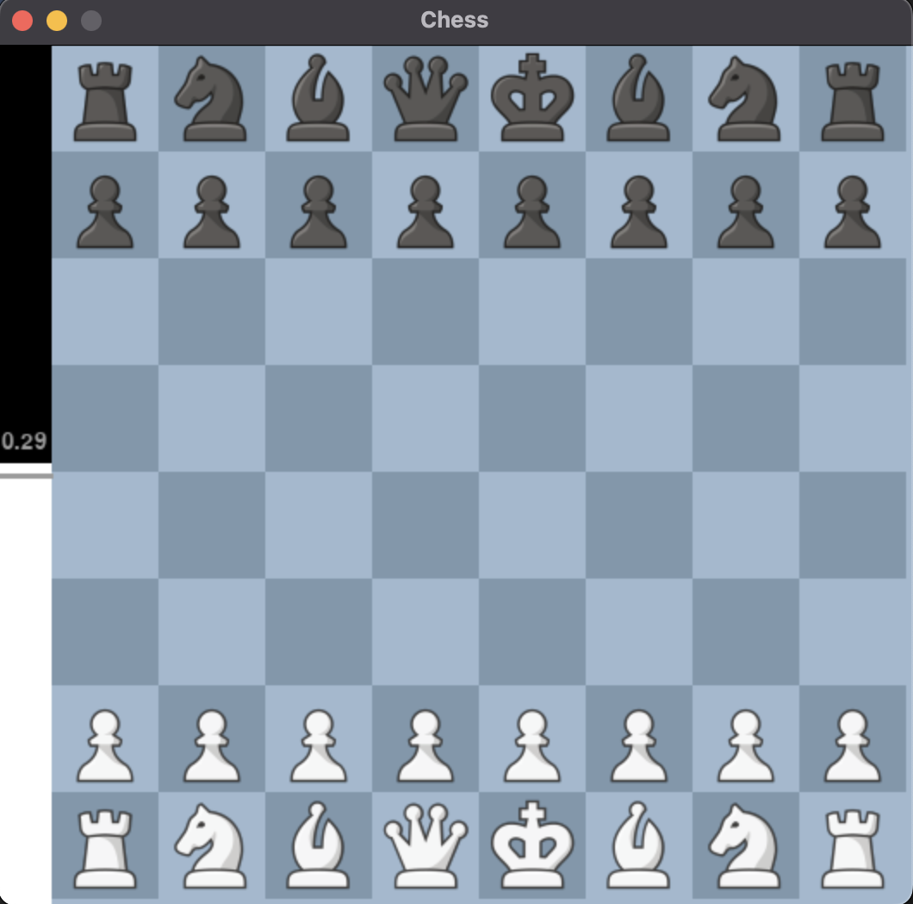
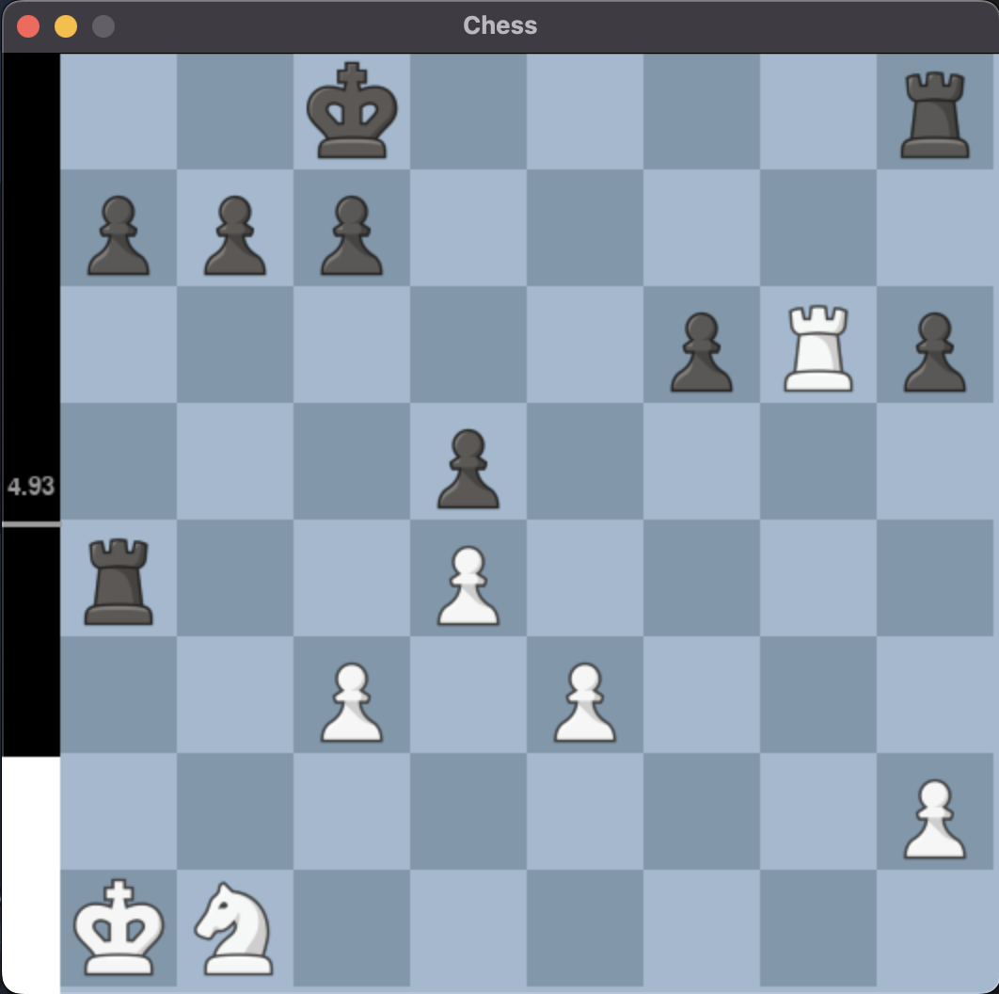
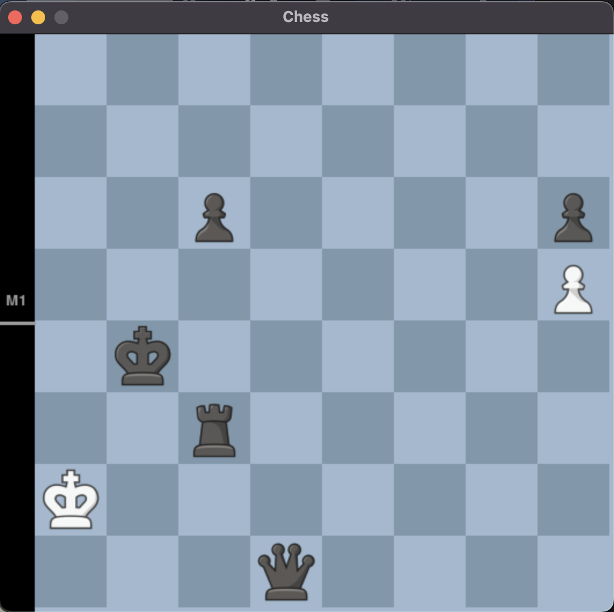
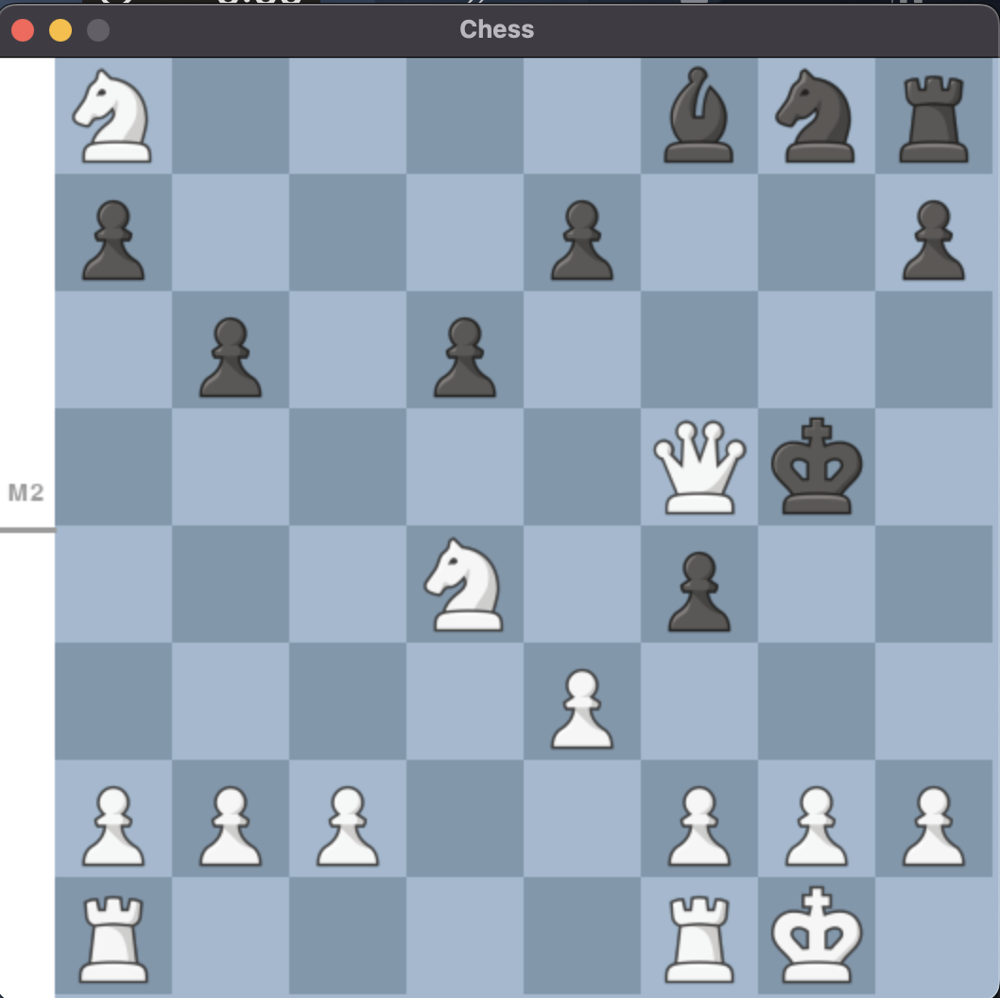

# Chess Game and Engine
An implementation of Chess with a player vs Computer (Engine). 
Evaluating correct and valud moves and the Wngine choose to play the best move based on it's calculations. Compared with Stockfish the chess game engine that has the highest elo in the world we evaluate our chess engine and how efficient it is on evaluating the best move.

    
    

    
    

## File Structure 
- `Chess`: The whole implementation of the chess game (pygame) and the game engine with use of algorithm Alpha Beta Pruning for evaluatins the best move.
- `Chess.com_API`: [Published-Data API from Chess.com](https://www.chess.com/news/view/published-data-api#pubapi-general) is a read-only REST API that has information such as player data, game data, and club/tournament information. 
    - [Documentation](https://chesscom.readthedocs.io/en/latest/)
    - Gather already established games from reputable chess players that have also been evaluated by "human" chess theory.
- `demo_images`: example of chess positions and their evaluations
- `PGNs`: Players' from Chess.com latest games in `.pgn` files.
- `Stockfish`: The evaluation of games using the stockfish python library compared with our chess game engine.
    - [Documentation](https://pypi.org/project/stockfish/#description)
